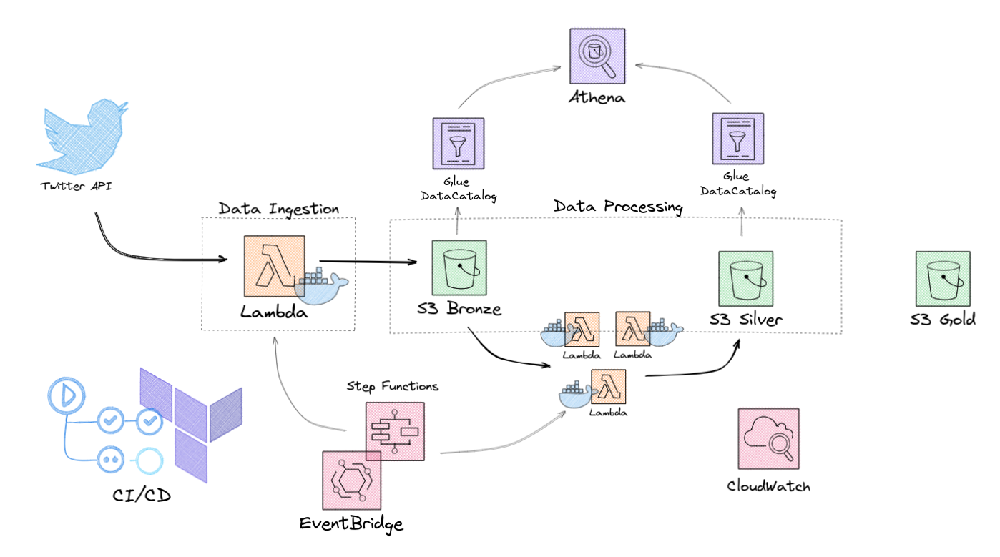
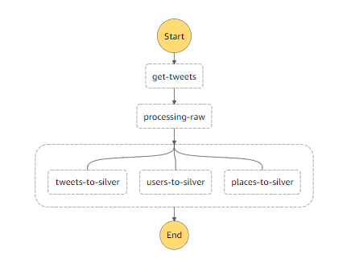
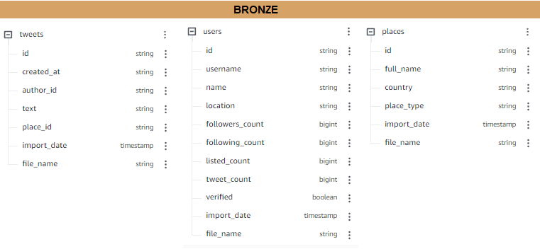
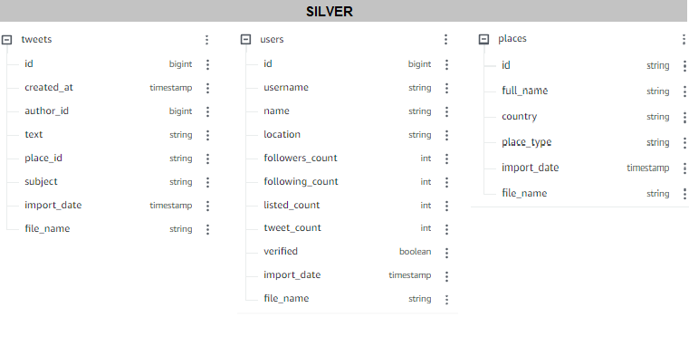

# **Fed By Tweets - Batch Ingestion**

# The Fed By Tweets Project
 
This repository is part of the fedbytweets project. 

The aim of the project is to set up an end-to-end ML system using the AWS infrastructure to ingest, process and extract useful information from Twetter data. An NLP model for text classification is used to extract the tweets' sentiment. Lastly, the analitics should be displayed on a dashboard.

The architecture is designed to be primarily covered by the AWS Free Tier, but still be scalable at some degree. The best practices of Data Engineering and MLOps are applied to build the system.

 

*This is an ongoing project

---

 

# Batch Ingestion

This repository should contain the necessary code to setup the tweets ingestion and processing up to the silver layer.

 

# Table of Contents
1. [Artchitecture](#Artchitecture)
2. [Workflow](#Workflow)
3. [Data-Lake](#Data-Lake)

 

# Artchitecture

 The data is pulled from Twetter's Recent API using the [av-tweet-ingestion](https://github.com/andreveit/av-tweet-ingestion) package, running in a Lambda Function. The data lands into the bronze layer of the data lake to be processed all the way the the silver layer.

 This processing is done by other lambda functions, orchestrated though AWS Step Functions. During this flow, the tables matadata are kept in AWS Glue Data Catalog, being possible to query the data and run some analytics using Athena.

 

 

# Workflow

At first, the ideia was to work with AirFlow to orchestrate the jobs, but AWS Step Functions 
happend to be more suitable to the problem at hand, offering economic advantages and a handier setup.

For the data processing itself, different tools were evaluated, such as AWS EMR and AWS Glue Jobs.
Lambda Functions ended up being the way to go, as the costs are very low and the planned work load isn't huge. It is also possible to parallelize the processing if necessary.

The code to run in the Lambdas was built using docker containers, making it easy to perform unit tests, integrations tests and CI/CD workflows.

The chart below displays how Step Functions was used to setup the data workflow of lambdas.

 

 

# Data-Lake

The Data Lake was built with three layers, BRONZE, SILVER and GOLD. The tweets get to the BRONZE landing layer in a json format. Next, they are processed to a tabluar format and saved into three tables, modeled as star schema. There is the fact table TWEETS and two dimensional tables USERS and PLACES.

At this point, the data is still kept in the BRONZE layer, even though in a tabular format. It wasn't performed any other processing than that. At each ingestion, new tweets data are appended to these tables. 

A new ETL process takes the data to the SILVER layer. It perfors data cleasing, adjusting data types, removing duplicated data and assuring the next layer's data to be trusted.

 

Below, it can be seen the schema of each table through the data lake layers.

 

 

 

